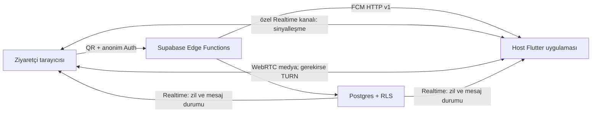

# DOQR dijital zil mimarisi

## Ürün sınırı

İlk sürüm yalnızca dijital zildir. Kilit açma, Raspberry Pi, röle, heartbeat ve diğer donanım akışları kaldırılmıştır. QR doğrudan kapı kimliği taşımaz; yalnızca veritabanında özeti bulunan, iptal edilebilir rastgele bir token taşır.

## İletişim akışı

- FCM yalnızca hostu uyandıran yüksek öncelikli zil bildirimidir; hassas teslimat kodu bildirim yüküne konmaz.
- Yazılı mesajlar Postgres'te saklanır ve özel Realtime kanalına yayınlanır.
- Ses ve görüntü WebRTC ile uçlar arasında akar. Supabase Realtime yalnızca offer/answer/ICE sinyalleşmesini taşır.
- NAT geçişi için WebRTC STUN kullanır; doğrudan bağlantı kurulamadığında backend'in ürettiği kısa ömürlü Cloudflare Realtime TURN kimliğiyle relay'e geçilir.
- Ziyaretçi oturumu Supabase Anonymous Auth'tur; oturum sırrı URL veya query parametresine yazılmaz.

## Planlar

Free planda zil ve FCM sayısı kısıtlanmaz; yazılı görüşme açıktır ve yalnızca en son üç ziyaret görünür/saklanır. Ses ile görüntü sunucu tarafında kapalıdır. İlk dijital zil oluşturulduğunda hesap başına tek seferlik üç günlük, özellik bakımından Pro denemesi başlar; deneme medya hakkı 30 dakika ses ve 15 dakika videodur. Pro plan yıllık $9.99, 90 günlük geçmiş, kurye notları, en fazla üç zil ve zil başına toplam üç host içerir. Medya adil kullanım değerleri veritabanından yönetilir.

Cloudflare TURN hesabının aylık egress kullanımı backend tarafından izlenir. 950 GB sert sınırında `rtc-config` kimlik üretmez, ziyaretçi medya seçenekleri kapanır ve dakikalık kontrol görevi aktif TURN kimliklerini iptal eder. Analitik okunamıyorsa maliyet güvenliği için sistem TURN tarafında kapalı davranır; yazılı zil çalışmaya devam eder.

Plan kontrolü yalnızca arayüzde yapılmaz. Edge Functions ve `reserve_doorbell_usage` çağrısı özellik hakkını yeniden doğrular. Geçmiş görünürlüğü RLS içindeki `can_host_view_ring` ile uygulanır; zamanlanmış temizlik eski satırları fiziksel olarak siler.

## Kurye eşleşmesi

Telefon veya cihaz özelliklerinden kargo şirketi tahmin edilmez. Ziyaretçi şirketini listeden kendisi seçer; bu bilgi doğrulanmış kimlik olarak sunulmaz. Sistem yalnızca aynı `courier_code` için aktif bir host notu olup olmadığını eşleştirir. Mesaj ve AES-GCM ile şifrelenmiş teslimat kodu ancak host görüşme ekranındaki paylaş düğmesine basınca, tek transaction içinde ziyaretçi sohbetine eklenir.

## Kötüye kullanım koruması

- Tarayıcıda üretilen rastgele yerel cihaz anahtarı, temel tarayıcı özellikleriyle birlikte sunucu gizli anahtarı kullanılarak HMAC'lenir.
- Ağ adresi ayrı bir HMAC ile özetlenir; ham IP saklanmaz.
- IP, cihaz, QR token ve kapı bazında atomik hız sınırı uygulanır.
- Host cihaz özetini kalıcı, ağ özetini varsayılan 24 saat engelleyebilir.
- Ağ engelinin aynı Wi‑Fi ağındaki başka kişileri etkileyebileceği arayüzde belirtilir.
- Cihaz verisi kimlik veya kurye şirketi doğrulaması değildir.

## Veri saklama ve gizlilik

Ziyaretçiye zil çalmadan önce cihaz/tarayıcı özellikleri, güvenlik özetleri, saklama süresi ve WebRTC medya davranışı açıklanır; açık onay olmadan anonim oturum başlatılmaz. Free geçmişi son üç ziyaret, Pro geçmişi en fazla 90 gündür. Ses ve görüntü DOQR tarafından kaydedilmez. Anonim Auth kullanıcıları aktif oturumları bittikten ve son ziyaretlerinden en az bir gün geçtikten sonra temizlenir.

## Temel tablolar

`doors`, `door_settings`, `door_public_tokens`, `rings`, `ring_events`, `chat_messages`, `user_push_tokens`, `door_blocks`, `courier_notes`, `plan_definitions`, `user_subscriptions`, `usage_monthly`, `turn_service_state`, `turn_credentials_issued`, `door_shared_users` ve `door_share_tokens`.

`door_devices`, `device_heartbeats`, `door_unlock_requests` ve `door_unlock_logs` bu aşamada migration tarafından kaldırılır.
